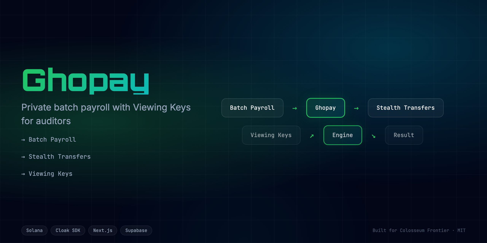

<div align="center">

# Ghopay - Ghost Payroll on Solana
**Private batch payroll for DAOs — powered by Cloak SDK on Solana.**



<br/>

[](https://ghopay.edycu.dev/)
[](https://ghopay.edycu.dev/pitch)

<br/>

[](#testing)
[](https://nextjs.org)
[](https://solana.com)

</div>

---

## The Problem

Crypto payroll is fully public. When a DAO paid 47 contributors on-chain, 12 received targeted phishing emails within 24 hours — each referencing the exact salary amount visible on the explorer.

Ghopay solves this with **stealth addresses**: individual salary amounts are invisible on public block explorers, while the treasury remains auditable via **Viewing Keys** issued to HR and compliance officers.

---

## How It Works

```
Treasury Wallet
      │
      ▼  executeStealthBatch()
 Cloak SDK ──► generates a unique stealth address per employee
      │
      ├──► Alice  →  stealth_addr_A  (5,000 USDC hidden)
      ├──► Bob    →  stealth_addr_B  (4,500 USDC hidden)
      └──► Charlie→  stealth_addr_C  (3,800 USDC hidden)

HR / Auditor
      │
      ▼  generateViewingKey()
 cloak_vk_<base58> ──► decrypts full payroll for compliance review
```

No individual salary is visible on-chain. The treasury debit is public, the per-employee amounts are not.

---

## Features

| Feature | Description |
|---|---|
| **Stealth batch transfers** | Send to N employees in a single transaction |
| **Viewing Keys** | Scoped disclosure for HR/auditors without exposing data publicly |
| **Animated UI** | ScrambleText reveals stealth addresses as they are assigned |
| **Particle background** | Canvas-based visual indicating network activity |
| **Health endpoint** | `GET /api/health` for uptime monitoring |

---

## Architecture

Please refer to the formal [Technical Architecture](./docs/ARCHITECTURE.md) document for detailed system diagrams, data flows, and tech stack breakdowns.

---

## Run Locally

```bash
git clone https://github.com/edycutjong/frontier-cloak.git
cd frontier-cloak
npm install
cp .env.example .env.local   # add your keys
npm run dev
```

Open [http://localhost:3000](http://localhost:3000).

---

## Testing

67 unit tests across all components, services, and the health API route.

```bash
npm test              # watch mode
npm run test:coverage # single run with coverage report
npm run ci            # typecheck + lint + coverage (CI gate)
```

Test files live alongside source files (`*.test.ts` / `*.test.tsx`).

Coverage spans:

- `src/lib/cloak.ts` — CloakService: init, executeStealthBatch, generateViewingKey
- `src/app/api/health/route.ts` — response shape and field types
- `src/components/` — all seven UI components
- `src/app/page.tsx` — dashboard navigation flow
- `src/app/about/page.tsx` — static content

---

## Project Structure

```
src/
├── app/
│   ├── api/health/route.ts   # uptime endpoint
│   ├── about/page.tsx        # about page
│   ├── layout.tsx            # root layout (StatusBar, Footer, TechStack)
│   └── page.tsx              # main HR dashboard
├── components/
│   ├── EmployeeTable.tsx     # payroll table with stealth address reveal
│   ├── Footer.tsx
│   ├── HeroLanding.tsx       # animated landing screen
│   ├── PayrollActions.tsx    # execute batch + generate viewing key
│   ├── StatusBar.tsx         # system status header
│   ├── TechStack.tsx         # tech badges
│   └── WowEffects.tsx        # ScrambleText + ParticleBackground
└── lib/
    └── cloak.ts              # CloakService (Solana SDK wrapper)
```

---

## Hackathon

Built for **Colosseum Frontier Hackathon 2026** — solo submission.
