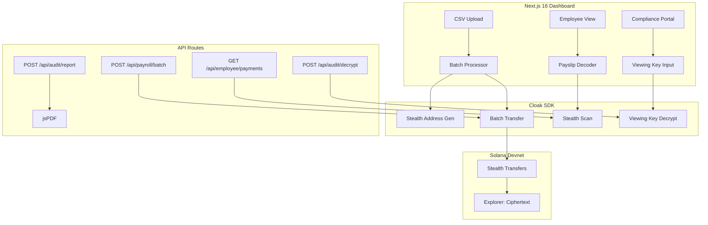

# Ghopay — Technical Architecture

## System Architecture



## Tech Stack

| Layer | Technology |
|---|---|
| **Frontend** | Next.js 16, React 19, Tailwind v4 |
| **Privacy** | Cloak SDK |
| **Database** | Supabase |
| **PDF** | jsPDF |
| **Auth** | Solana wallet adapter |

## Cloak SDK Integration Map

| Feature | Use Case | Depth |
|---|---|---|
| **Stealth Addresses** | Per-employee stealth address per payroll | 🟢 Core |
| **Batch Transfers** | Send 5+ payments in single tx | 🟢 Core |
| **Viewing Keys** | Scoped disclosure for HR/auditors | 🟢 Star Feature |
| **Key Registration** | Employee registers receiving key | 🟢 Supporting |
| **Stealth Scan** | Employee scans for incoming stealth payments | 🟢 Supporting |

## Database Schema

```sql
CREATE TABLE payroll_batches (
    id UUID PRIMARY KEY DEFAULT gen_random_uuid(),
    employer_wallet TEXT NOT NULL,
    employee_count INT NOT NULL,
    total_amount NUMERIC NOT NULL,
    cloak_tx_hash TEXT,
    status TEXT DEFAULT 'pending',
    created_at TIMESTAMPTZ DEFAULT NOW()
);

CREATE TABLE payroll_entries (
    id UUID PRIMARY KEY DEFAULT gen_random_uuid(),
    batch_id UUID REFERENCES payroll_batches(id),
    employee_label TEXT NOT NULL,
    stealth_address TEXT NOT NULL,
    amount NUMERIC NOT NULL,
    viewing_key_hash TEXT
);
```

## API Routes

| Method | Path | Description |
|---|---|---|
| POST | `/api/payroll/batch` | Upload CSV → batch stealth transfers |
| GET | `/api/payroll/history` | Employer batch history |
| GET | `/api/employee/payments` | Employee's decoded payment feed |
| POST | `/api/audit/decrypt` | Paste Viewing Key → decrypted payroll |
| POST | `/api/audit/report` | Generate PDF audit report |
